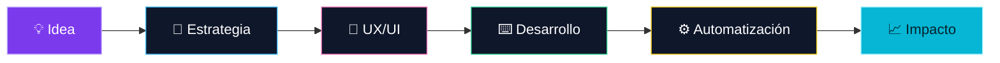

<!--
  PERFIL DE GITHUB — INKRAAD
  Las métricas, trofeos, lenguajes y gráfico de actividad se actualizan solos
  conforme se hagan públicos nuevos repositorios y contribuciones.
-->

<div align="center">
  <a href="https://github.com/INKRAAD">
    
  </a>
  <br />
  <br />

  <a href="https://github.com/INKRAAD?tab=followers">
    
  </a>
  <a href="https://github.com/INKRAAD?tab=repositories">
    
  </a>
  
</div>

## ✦ Hola, soy Sebastian

```ts
const sebastian = {
  alias: "INKRAAD",
  rol: ["Full-Stack Developer", "Marketer"],
  base: "Tacna, Perú ↔ Antofagasta, Chile",
  formación: ["Desarrollo Frontend & Backend", "Licenciatura en Marketing Digital"],
  misión: "Diseñar y construir productos digitales útiles, claros y memorables.",
  disponiblePara: ["Freelance", "Nuevas oportunidades", "Colaboraciones"],
};
```

Soy desarrollador web con una mirada centrada en la experiencia. Combino desarrollo full-stack, diseño UX/UI y marketing digital para transformar una idea en una solución que se vea bien, funcione bien y conecte con las personas.

<details>
  <summary><b>🧭 Ahora mismo</b></summary>
  <br />

  - 🎓 Cursando una licenciatura en Marketing Digital.
  - 🧩 Fortaleciendo mi portafolio con proyectos web reales.
  - 🤝 Disponible para oportunidades freelance y retos donde pueda seguir creciendo.
  - 🔭 Explorando el cruce entre UX/UI, automatización y desarrollo de software.
</details>

## 🧠 Mi enfoque creativo



> No me interesa crear por crear: quiero que cada interfaz tenga intención, cada automatización ahorre tiempo y cada proyecto cuente una historia útil.

## 🛠️ Tecnologías que uso

<div align="center">
  
</div>

<br />

<div align="center">
  
  
  
  
  
</div>

## 🌱 En mi radar de aprendizaje

<div align="center">
  
  <br />
  <sub>Java · Next.js · Docker · Go · C#</sub>
</div>

## 📊 Mi universo GitHub

<div align="center">
  
  <br />
  
  <br />
  
</div>

## 🏆 Gabinete de trofeos

<div align="center">
  
</div>

<sub>Los trofeos usan únicamente actividad pública y se regeneran todos los días.</sub>

## 🎮 Arcade de contribuciones

<div align="center">
  <picture>
    <source media="(prefers-color-scheme: dark)" srcset="https://raw.githubusercontent.com/INKRAAD/INKRAAD/output/pacman-contribution-graph-dark.svg" />
    <source media="(prefers-color-scheme: light)" srcset="https://raw.githubusercontent.com/INKRAAD/INKRAAD/output/pacman-contribution-graph.svg" />
    
  </picture>
</div>

<details>
  <summary><b>🐍 Bonus: modo Snake</b></summary>
  <br />
  <picture>
    <source media="(prefers-color-scheme: dark)" srcset="https://raw.githubusercontent.com/INKRAAD/INKRAAD/output/github-contribution-grid-snake-dark.svg" />
    <source media="(prefers-color-scheme: light)" srcset="https://raw.githubusercontent.com/INKRAAD/INKRAAD/output/github-contribution-grid-snake.svg" />
    
  </picture>
</details>

## 🚀 Próximos proyectos

<div align="center">
  <a href="https://github.com/INKRAAD?tab=repositories">
    
  </a>
  <a href="https://github.com/INKRAAD?tab=repositories">
    
  </a>
  <a href="https://github.com/INKRAAD?tab=repositories">
    
  </a>
</div>

<br />

> Cada repositorio que publique aquí tendrá una explicación clara: problema, proceso, tecnologías y aprendizajes. Así el portafolio crecerá con contexto, no solo con código.

<!--
  Cuando tengas un proyecto público, reemplaza uno de los badges anteriores por:

  <a href="https://github.com/INKRAAD/NOMBRE-DEL-REPOSITORIO">
    
  </a>
-->

## 🤝 Conectemos

<div align="center">
  <a href="https://www.linkedin.com/in/sebastian-ig-uruchi-cruz-68b504330/">
    
  </a>
  <a href="https://www.instagram.com/inkraadm/">
    
  </a>
  <a href="https://www.facebook.com/inkraadgxz">
    
  </a>
  <a href="https://www.tiktok.com/@inkraadgxz">
    
  </a>
</div>

<br />

<div align="center">
  <i>“La creatividad no es un extra: es parte de cómo resolvemos problemas.”</i>
  <br /><br />
  
</div>
